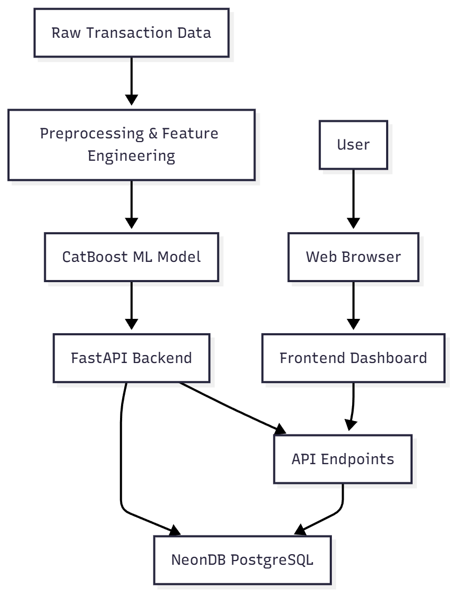

          
# Fraud Detection AI System for BFSI Domain

## Abstract / Executive Summary
This project delivers an end-to-end AI-powered fraud detection system tailored for the Banking, Financial Services, and Insurance (BFSI) sector. It encompasses data preprocessing, feature engineering, machine learning model training, a FastAPI-based transaction scoring API, and deployment via Docker and Hugging Face Spaces. The system predicts transaction risk scores and provides interpretable explanations for fraud triggers, supporting real-time decision-making and compliance.

## Problem Statement / Use Case
Financial institutions face increasing challenges in detecting fraudulent transactions due to evolving tactics and large transaction volumes. Manual review is inefficient and error-prone. This project automates fraud detection, enabling scalable, accurate, and explainable risk assessment for BFSI transactions.

## Solution Overview
The solution integrates:
- Data cleaning and feature engineering for robust input
- CatBoost ML model for fraud risk prediction
- FastAPI backend for real-time scoring and explanations
- Frontend dashboard for analytics and prediction visualization
- Containerized deployment for reproducibility and scalability
## 🌐 Deployment Links

| Component        | URL / Link | Status | Description |
|------------------|------------|--------|-------------|
| **Frontend (Dashboard UI)** | https://risk-shield.onrender.com/frontend | ✅ Live | User interface for fraud scoring & analytics |
| **Backend API (FastAPI)** | https://pylord-api-bfsi.hf.space/docs | ✅ Live | REST API with `/predict` & `/explain` endpoints |
| **GitHub Repository (Forked Codebase)** | https://github.com/PIYUSH-BHAVSAR/Batch-2_LLM-Frontend-B | ✅ Public | Contains frontend + backend integration code |

## 🏗️ System Architecture

Below is the high-level architecture of the Fraud Detection AI System:



## Tech Stack
| Component         | Technology                |
|-------------------|--------------------------|
| Data Processing   | Python, Pandas           |
| ML Model          | CatBoost                 |
| API Backend       | FastAPI                  |
| Frontend          | HTML, JavaScript, CSS    |
| Deployment        | Docker, Hugging Face     |
| Storage           | CSV, Local Filesystem    |

## Features
- Automated fraud risk scoring for transactions
- Explainable AI: highlights fraud triggers
- RESTful API for integration
- Frontend dashboard for analytics and predictions
- Containerized deployment (Docker)
- Cloud hosting via Hugging Face Spaces

## Dataset Information
- **Source:** Proprietary and public BFSI transaction datasets
- **Files:**
  - `data/raw/fraud_dataset.csv`
  - `data/raw/fraud_detection.csv`
  - `data/raw/fraud_detection_dataset_LLM.csv`
  - `data/raw/fraud_detection_dataset_given.csv`
- **Features:** Transaction amount, type, timestamp, account details, merchant info, etc.
- **Labels:** Fraudulent (1) / Non-fraudulent (0)

## Model / Algorithm / Processing Steps
1. **Preprocessing:**
   - Missing value imputation
   - Outlier removal
   - Categorical encoding
2. **Feature Engineering:**
   - Derived features (e.g., transaction frequency, average amount)
   - One-hot and label encoding
3. **Model Training:**
   - CatBoost classifier
   - Hyperparameter tuning
   - Balanced sampling for class imbalance
4. **Evaluation:**
   - Metrics: Accuracy, Precision, Recall, F1, ROC-AUC
   - Error analysis

## Backend API Overview
- **Framework:** FastAPI
- **Location:** `API/API-BFSI/app.py`
- **Functionality:**
  - Accepts transaction data
  - Returns risk score and fraud trigger explanations

## Endpoint List
| Endpoint                | Method | Description                       |
|-------------------------|--------|-----------------------------------|
| `/predict`              | POST   | Score transaction, return risk    |
| `/explain`              | POST   | Explain fraud triggers            |
| `/health`               | GET    | API health check                  |

## Request and Response Examples
### `/predict` Request
```json
{
  "transaction": {
    "amount": 1200.50,
    "type": "online",
    "account_id": "A12345",
    "timestamp": "2024-06-01T12:34:56Z",
    "merchant": "XYZ Store"
  }
}
```
### `/predict` Response
```json
{
  "risk_score": 0.87,
  "is_fraud": true,
  "explanation": ["High amount", "Unusual merchant"]
}
```
### `/explain` Request
```json
{
  "transaction_id": "TXN7890"
}
```
### `/explain` Response
```json
{
  "triggers": ["Frequent transactions", "New device"]
}
```

## Frontend Overview
- **Location:** `frontend/`
- **Features:**
  - Dashboard for analytics (`dashboard.html`)
  - Bulk and single prediction interfaces
  - Model performance visualization
  - Authentication and user management

## Deployment Details
### Local Run
1. Install dependencies:
   ```bash
   pip install -r API/API-BFSI/requirements.txt
   ```
2. Start API:
   ```bash
   python API/API-BFSI/app.py
   ```
3. Open `frontend/index.html` in browser

### Docker Deployment
1. Build Docker image:
   ```bash
   docker build -t bfsi-fraud-api API/API-BFSI/
   ```
2. Run container:
   ```bash
   docker run -p 8000:8000 bfsi-fraud-api
   ```

### Cloud Deployment (Hugging Face Spaces)
1. Push code and Dockerfile to Hugging Face repository
2. Configure Space to use Docker
3. Access deployed API via provided URL


## **Performance Metrics**

| Metric                      | Value      | Notes                                        |
| --------------------------- | ---------- | -------------------------------------------- |
| **Accuracy**                | **0.76**   | Overall correctness across all transactions  |
| **Precision**               | **0.24**   | Of flagged frauds, 24% are truly fraud       |
| **Recall (Detection Rate)** | **0.83** ✅ | **Primary objective:** minimize missed fraud |
| **F1 Score**                | **0.37**   | Balance between precision & recall           |
| **AUC-ROC**                 | **0.80**   | Good class separability                      |

### **Confusion Matrix**

|                   | Predicted Fraud | Predicted Normal |
| ----------------- | --------------- | ---------------- |
| **Actual Fraud**  | **71 (TP)**     | **15 (FN)** ⚠️   |
| **Actual Normal** | **224 (FP)** ⚠️ | **690 (TN)**     |

**Interpretation:**

* Model **successfully detects 83% of actual fraud** (high recall)
* Higher false positives are **acceptable in BFSI risk-first environments**, where missing fraud is more costly.

---

### **Feature Importance (Top Signals)**

| Feature                    | Importance |
| -------------------------- | ---------- |
| transaction_amount         | 0.234      |
| account_age_days           | 0.189      |
| kyc_verified               | 0.156      |
| is_night_txn               | 0.123      |
| hour_of_day                | 0.098      |
| channel_encoded            | 0.087      |
| is_high_amount_transaction | 0.073      |
| day_of_week                | 0.040      |


## Future Enhancements
- Integrate real-time streaming data sources
- Add advanced explainability (SHAP, LIME)
- Support multi-language frontend
- Expand to other fraud types (insurance, loan)
- Deploy on additional cloud platforms (AWS, Azure)

## Conclusion
This project provides a robust, scalable, and explainable fraud detection solution for BFSI organizations. It streamlines risk assessment, supports compliance, and enables rapid integration into existing workflows. Future improvements will further enhance accuracy, usability, and coverage.

